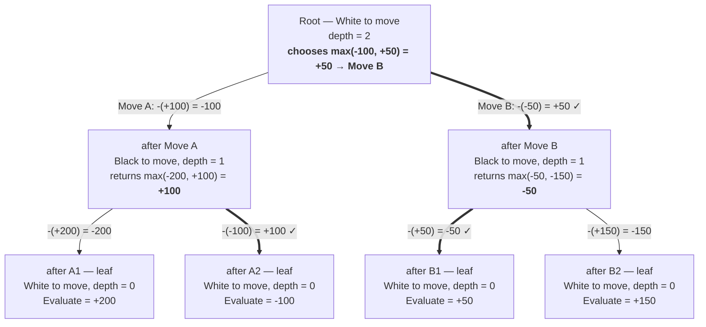

# Negamax Search — Visual Walkthrough

`SimpleBot` uses a fixed-depth **negamax** search. Negamax is minimax for
zero-sum games, exploiting the identity `max(a, b) = -min(-a, -b)` so we
never need a separate "minimizing" branch — every node maximizes, and the
score is negated as it propagates up.

Two ingredients make this work:

1. `Evaluate` returns the score **from the side-to-move's perspective**
   (see the `perspective` flip in `Evaluation.Evaluate`).
2. The recursive call is `-Search(...)` — flipping perspective each ply.

## A worked example at depth 2

Root: **White to move**, two candidate moves *A* and *B*. After each,
Black has two replies. Material balance at each leaf (positive = White
ahead in centipawns):

| leaf | W − B |
|------|------:|
| A1   | +200  |
| A2   | −100  |
| B1   |  +50  |
| B2   | +150  |

At every leaf the side to move is White again (2 plies later), so
`Evaluate` returns those numbers directly.



### Reading the tree

- **Leaves (depth 0):** plain material count, White's perspective.
- **Black's nodes (depth 1):** each child's score is **negated** on the
  way in (so it now reads as Black's perspective), then Black picks the
  max — i.e. Black's best reply.
- **Root (depth 2):** each child's score is **negated again** (back to
  White's perspective), then White picks the max.

The double negation is why the same algorithm works for both sides: each
ply, we flip whose-perspective-is-this and take the max.

### Why Move B wins

Looking at raw leaves, *Move A* has the highest single payoff (+200 via
A1). But Black is choosing the reply, and Black will pick A2 (−100 for
White). After *Move B*, Black's best is B1 (+50 for White). So B is the
better practical choice — exactly what the search returns.

## Mapping to the code

```text
SearchRoot                    ← outer loop, White's "max" layer
  for each move:
    board.MakeMove(move)
    score = -Search(d-1)      ← negation #1 (root ↔ Black)
    board.UnmakeLastMove()
  sort, pick best

Search(d)
  if d == 0: return Evaluate  ← side-to-move perspective
  for each move:
    MakeMove
    score = -Search(d-1)      ← negation #2 (Black ↔ White at leaves)
    bestEvaluation = max(...)
    UnmakeLastMove
  return bestEvaluation
```

Mate handling (`-MateScore` when no legal moves and in check, `0` for
stalemate) lives inside `Search`, so a forced mate dominates any
material score and propagates up through the same negation machinery.

## What this picture is missing

- **No pruning.** Every branch is explored fully. Alpha-beta would prune
  branches once they're proven worse than something already found —
  visually, whole subtrees would get cut.
- **Move ordering doesn't matter** for correctness here, only for speed
  (and only once pruning exists).
- **Quiescence.** Depth-0 leaves can sit in the middle of a capture
  sequence, so the static eval is noisy. A quiescence search would
  extend captures until the position is "quiet" before evaluating.
